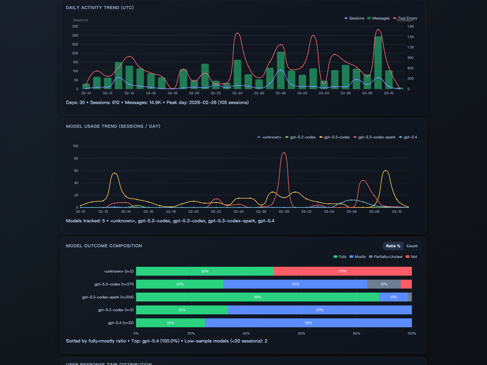
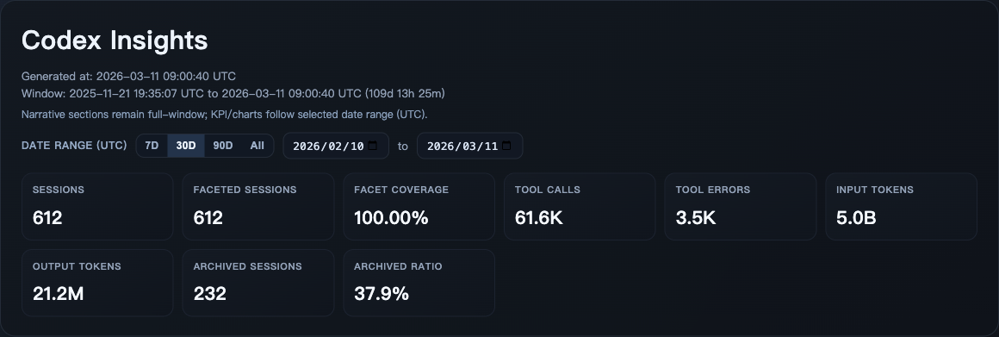
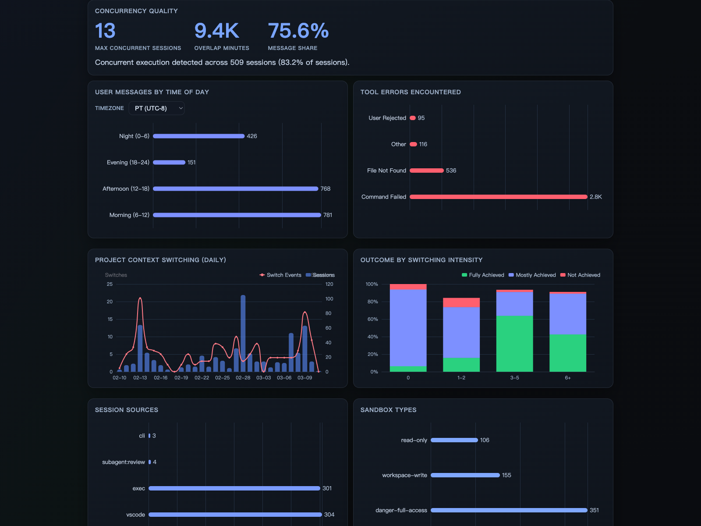
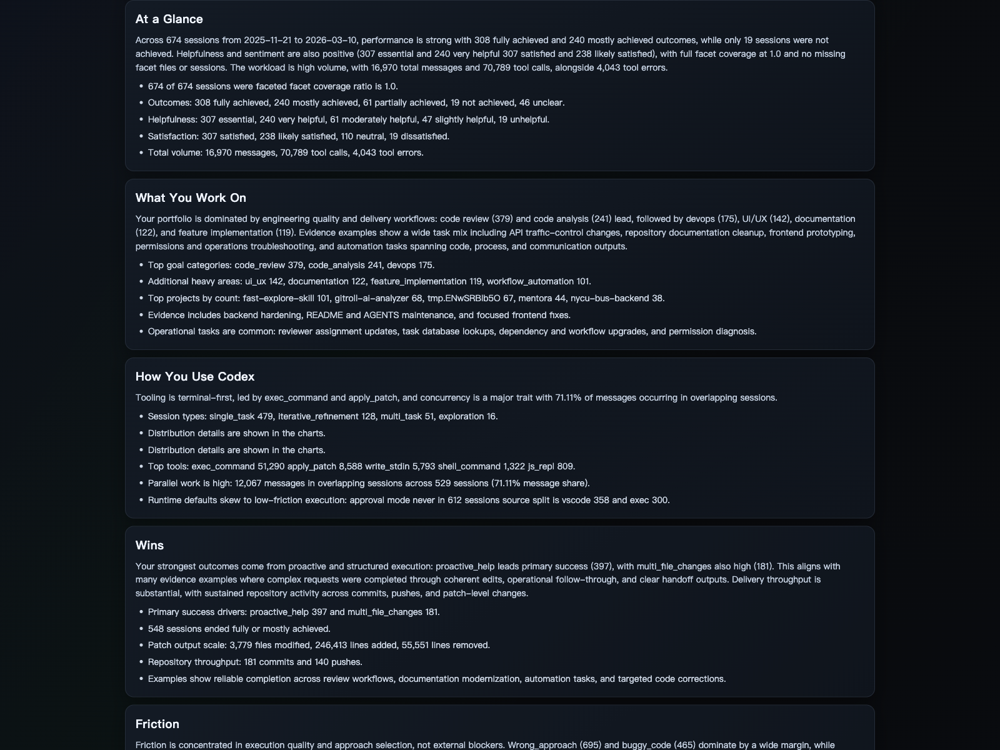

# Codex Insights Skill

Generate high-signal Codex usage insights from local Codex data (`state_5.sqlite` + rollout files), then compile a report with visualizations.

This repository contains a complete skill bundle at `.agents/skills/codex-insights` with:

- extraction (`manifest`, `meta`, `stats`)
- hybrid facet analysis (`rules + LLM`)
- narrative synthesis (`LLM, strict JSON contract`)
- report rendering (`report.html`)



## What This Skill Produces

Given Codex local state, the pipeline generates:

- `manifest.jsonl` + `manifest.meta.json`
- `meta/<session_id>.json` (`SessionMetaV1`)
- `evidence/<session_id>.json` (privacy-filtered evidence)
- `facets/<session_id>.json` (`FacetV1`)
- `stats.json` (`StatsV1`)
- `narrative.json` (`NarrativeV1`)
- `report.html`
- `state_index.json` (incremental rebuild state)

## Data Inputs

Required inputs:

- SQLite DB: `~/.codex/state_5.sqlite`
- Sessions root: `~/.codex/sessions`
- Archived sessions root: `~/.codex/archived_sessions`

Default output workspace:

- `~/.codex/insights/latest`

## Requirements

- Python 3.10+
- `codex` CLI available in `PATH` for hybrid classification and narrative stages
- Access to local Codex data paths listed above

## Quick Start

Run the full pipeline:

```bash
python3 .agents/skills/codex-insights/scripts/run_pipeline.py \
  --db ~/.codex/state_5.sqlite \
  --sessions-root ~/.codex/sessions \
  --archived-root ~/.codex/archived_sessions \
  --scope sqlite_threads \
  --privacy redacted \
  --engine hybrid \
  --classifier-model gpt-5.3-codex-spark \
  --narrative-model gpt-5.3-codex
```

Then open:

```bash
~/.codex/insights/latest/report.html
```

## Screenshots

### Overview + KPI Cards



### Activity, Model Trends, and Outcome Composition


### Concurrency and Operational Diagnostics



### Narrative Sections


